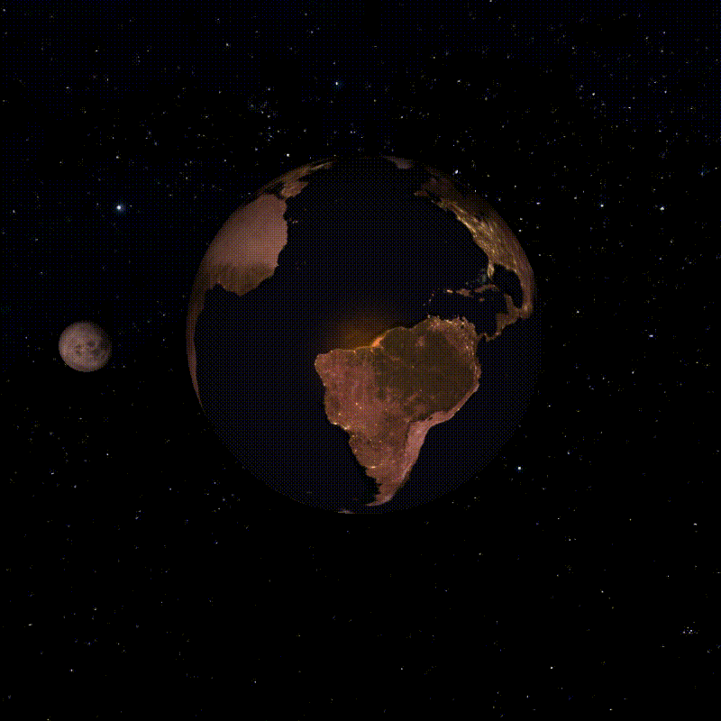

# Краткое описание

Данная программа рендерит 3д объекты, используя спецификацию OpenGL версии 3.3

Язык - С++

# Описание файлов репозитория:
**OpenGL Project** - основные файлы проекта:
* _Textures_        - папка с текстурами
* _Models_          - папка с 3д моделями
* _main.cpp_        - основной код программы (Инициализация окна, загрузка моделей, настройка шейдеров и освещения, рендеринг)
* _model.h_         - содержит классы для загрузки моделей и их рендеринга
* _camera.h_       - класс для управления камерой
* _shader.h_        - класс для работы с шейдерами (Загрузка, компиляция, использование)
* _texture.h_        - класс для работы с текстурами
* _vertex*.vsh_     - вершинные шейдеры (Основной, для карты глубины, для отображения источников света, для скайбокса)
* _fragment*.fsh_ - фрагментные шейдеры, аналогично вершинным
* _glad.c_             - подключение GLAD
* _stb_image.h_, _stb_image.cpp_   - файлы для загрузки изображений

**Demo** - папка с файлами для демонстрации работы программы

Подключаемые библиотеки: GLFW v3.3.3, GLAD, GLM, Assimp v5.0.1, stb_image
# Реализовано:
* Модель освещения Блинна-Фонга
* Направленный и точечный затухающий свет
* Поддержка диффузных карт, карт отражения, излучения и нормалей
* Отображение теней при помощи карт глубины
* Скайбокс
* Управление камерой
* Загрузка 3д моделей при помощи библиотеки Assimp

# Демо: 

